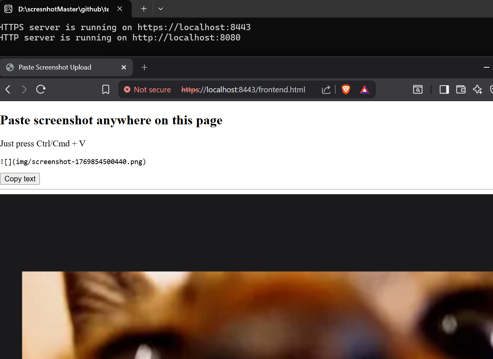

# 📸 Clipboard Screenshot Uploader (Markdown-Ready)

A minimal web tool that lets you paste screenshots directly from your clipboard and automatically upload them to a server, instantly generating a Markdown image reference.

> No file picker.
> No buttons.
> Just Ctrl/Cmd + V.



# ✨ Features

Paste screenshots directly from the clipboard

Zero UI interaction beyond pasting

Automatic file upload and naming

Generates a ready-to-use Markdown image link

Ideal for Markdown editors, wikis, and PKM workflows

SSL supported for quick copy to clipboard

# 🧠 How It Works

Take a screenshot using your OS

Open the web page

Press Ctrl/Cmd + V

The image is:

extracted from the clipboard

uploaded to the backend

saved to disk with an auto-generated filename

A Markdown image reference is produced:

```md

```

and a button **Copy text** gives you the option to copy the mark-down ready string to the clipboard

# 🛠 Tech Stack

Frontend: HTML + Vanilla JavaScript (Clipboard API)

Backend: Node.js + Express

File Uploads: Multer

Storage: Local filesystem

```pgsql
📂 Project Structure
.
├── server.js
├── frontend.html
└── img/
    └── screenshot-<timestamp>.png
```

# 🚀 Getting Started

## 1. Install dependencies

```bash
npm install
```

## 2. Start the server

```bash
node server.js
```

Server will run at:

```bash
https://localhost:8443
http://localhost:8080
```

## 3. Open the frontend

Open frontend.html in your browser, take a screenshot, and paste it.

### 🎯 Design Philosophy

Clipboard-first workflow

Minimal surface area

No configuration required

Optimized for speed and focus

Markdown as a first-class output

### 🧩 Use Cases

Markdown editors

Personal wikis

Documentation systems

Developer notes

Screenshot-heavy workflows

### ⚠️ Notes

Files are stored locally in the uploads/ directory

This project is intended for local or trusted environments

No authentication or sandboxing is implemented by design

### ✅ Status

✔ Stable
✔ Functional
✔ Intentionally minimal
✔ SSL supported